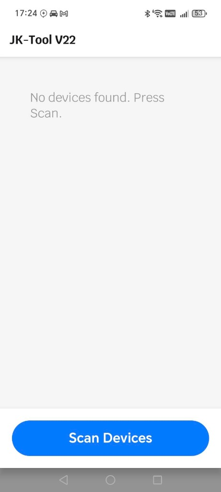
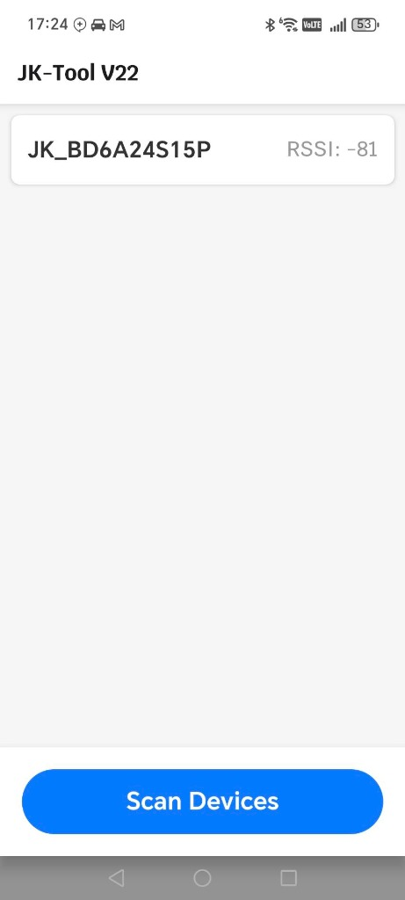
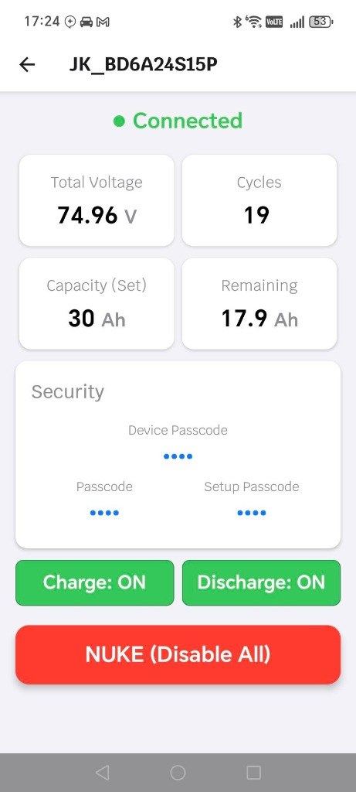
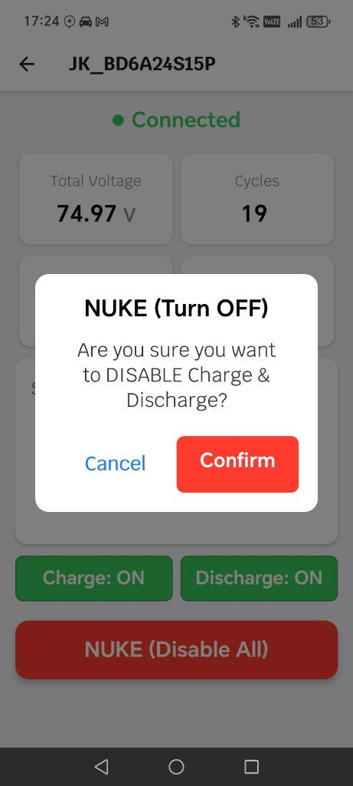
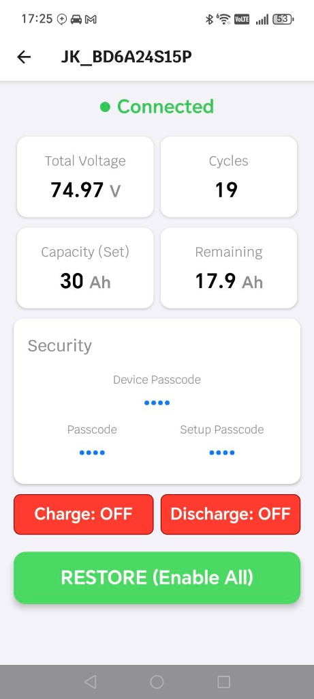

# JK-Tool (JKBMS Management Utility)

**Version:** V22 (Final Polish)  
**Framework:** React Native (Expo)  
**Language:** TypeScript  

## 📌 Project Overview
JK-Tool is a specialized Android application designed to manage and monitor **JKBMS (JK Battery Management Systems)** via Bluetooth Low Energy (BLE). It provides a clean, user-friendly dashboard to view critical battery statistics (Voltage, Capacity, Cycles) and perform administrative actions (Nuke/Restore Charge & Discharge states).

## ✨ Key Features
*   **Auto-Scan & Connect**: Automatically scans for JKBMS devices and connects seamlessly.
*   **Real-time Dashboard**: Displays Total Voltage, Capacity (Remaining/Set), Cycle Count, and Cell Status.
*   **Security Info**: Reveals Device Passcode, Connection Password, and Setup Passcode.
*   **Nuke / Restore**: One-click control to Enable/Disable both Charge and Discharge MOSFETs with safety delays.
*   **Robust Connectivity**: Handles connection drops, dirty states, and auto-restarts BLE services when needed.
*   **Polished UI**: Clean 2x2 grid layout, custom Thai font (Krub), and clear status indicators.

## 🛠️ Technology Stack
*   **Core**: React Native 0.81.5, Expo 54
*   **BLE**: `react-native-ble-plx` for Bluetooth Low Energy communication.
*   **UI**: Custom components with `react-native-safe-area-context`.
*   **Fonts**: `@expo-google-fonts/krub` for typography.
*   **Storage**: `@react-native-async-storage/async-storage` for state persistence.

## 🚀 Installation & Build

### Prerequisites
*   Node.js & npm/yarn
*   JDK 17
*   Android SDK & Command Line Tools

### Local Development
```bash
# Install dependencies
npm install

# Start Metro Bundler
npx expo start
```

### Build APK (Release)
```bash
# Clean previous builds
cd android
./gradlew clean

# Build Release APK
./gradlew assembleRelease
```
*Output Location:* `android/app/build/outputs/apk/release/app-release.apk`

## 📸 Screenshots
| **Scan Screen** | **Device List** | **Connected Dashboard** |
|:---:|:---:|:---:|
|  |  |  |

| **Nuke Confirmation** | **Restore State** |
|:---:|:---:|
|  |  |

## 🙏 Credits & Resources

**App Icon:**
*   [Flaticon](https://www.flaticon.com/)

**Key Resources & Inspiration:**
*   [jkbms_password_retrieve_tool](https://github.com/ech0-py/jkbms_password_retrieve_tool) by ech0-py
*   [esphome-jk-bms](https://github.com/syssi/esphome-jk-bms) by syssi
*   [batmon-ha](https://github.com/fl4p/batmon-ha) by fl4p

---
*Generated by Antigravity Agent*
